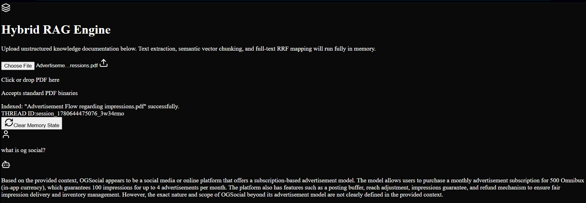

notion link: [text](https://app.notion.com/p/Being-me-32b65d62c991803d99a2dd306caf809a?source=copy_link)
# Custom Resilient RAG Engine

A production-minded, full-stack Retrieval-Augmented Generation (RAG) platform built to handle heavy document ingestion, layout-preserving text parsing, and verifiable semantic retrieval. 

Instead of treating the data pipeline like a black box, this system uses a custom **Engine Inspector** UI layer that breaks down vector similarity distances and uncovers the literal context strings injected into the LLM.

---

## Technical Stack
* **Framework:** Next.js (App Router) running the **Turbopack** compiler
* **Language:** TypeScript (`moduleResolution: "bundler"`)
* **Database & Vectors:** PostgreSQL + `pgvector`
* **Database Layer:** Drizzle ORM
* **Binary Extraction:** Native `pdfjs-dist` (Legacy ESM build configuration)

---

## System Engineering Log & Critical Breakthroughs

Building this application without using bulk external wrappers (like LangChain or LlamaIndex) meant hitting several low-level compilation and runtime bugs. Here is what broke and how we engineered around it:

### 1. Next.js Bundler Path Clashes
* **The Problem:** Configuring the workspace with strict TypeScript bundler resolution parameters resulted in fatal route compilation crashes (`Module not found: Can't resolve './schema.js'`).
* **The Fix:** Under the hood, Next.js expects clean, extensionless absolute mapping inside App Router chunks. We stripped all rigid `.js` or `.ts` file suffixes across our active route pathways (`route.ts`, `ingest.ts`, and our Drizzle configuration files), leaving native asset lookup completely to the framework compiler.

### 2. PDF.js Isolated Worker Thread Collapse
* **The Problem:** Forcing server-side string extraction directly through `pdfjs-dist` threw execution breaks because Next.js sandboxes server logic into memory buffers:
  ```text
  Setting up fake worker failed: "Cannot find module '.../pdf.worker.mjs'"

```

* **The Fix:** Standard dynamic imports fail when bundled via Turbopack since the relative path maps out of runtime context. We bypassed implicit module loaders completely. We combined native Node.js filesystem primitives to read the `.mjs` asset directly from the local node node module tree and cast it to an absolute static string path using `pathToFileURL`:
```typescript
const workerPath = path.join(process.cwd(), "node_modules", "pdfjs-dist", "legacy", "build", "pdf.worker.mjs");
pdfjs.GlobalWorkerOptions.workerSrc = pathToFileURL(workerPath).toString();

```


### 3. Connection Socket Exhaustion (`ECONNREFUSED`)

* **The Problem:** Heavy document streams and concurrent ingestion transactions caused transient pipeline dropouts due to localized connection pool exhaustion.
* **The Fix:** Verified socket bindings locally (`netstat -ano | findstr 5432`) and transitioned the application client from short-lived singular database client definitions to an explicit, persistent connection pool configuration under Drizzle to safely absorb simultaneous text transactions.

---

## Core Retrieval Safeguard: Similarity Thresholding

During testing, asking an out-of-bounds query (*e.g., "Tell me who is Elon Musk?"*) when the database only holds project management or business workflows exposed a massive flaw in standard, naive top-$K$ vector setups. The vector space *always* yields matches, forcing entirely irrelevant chunks into the prompt context. This wastes tokens and causes model hallucinations.

We corrected this by implementing a hard distance constraint directly in our SQL query layout:

$$\text{Similarity Score } (S) = 1 - \text{CosineDistance}(\vec{u}, \vec{v}) \ge 0.70$$

If the closest vector chunks fail to cross this $0.70$ similarity floor, the retrieval layer instantly blocks prompt modification. The engine routes the execution clean away from the context generator and sets a visible warning state in the interface: `⚠️ Direct Model Knowledge (No Grounded Context Found)`.

---

## UI/UX Framework

The interface avoids cluttered data loops in favor of a responsive, two-column layout (`bg-zinc-950`):

* **Left Column (35%):** Document Control Center handling drop zone tracking, real-time extraction latency metrics, and ingestion load volumes.
* **Right Column (65%):** Unified chat feed utilizing clear semantic contrast. Every message payload contains an expandable **Inspector Accordion** exposing the exact database matching metrics (*e.g., Match: 84.2%*) and the final compiled context layout for maximum system accountability.

---

## Current Status & Next Steps

🔧 **Status: Active Improvement / Work-In-Progress**

The core pipeline from document stream to semantic vector validation is stable. Current efforts are focused on:

1. Hardening the thresholding boundaries to test how different vector distance metrics handle varying text structures.
2. Integrating a session-based metadata layer to ensure multiple parallel users can query distinct private datasets simultaneously.